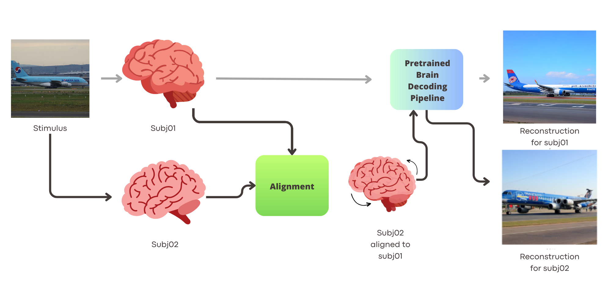
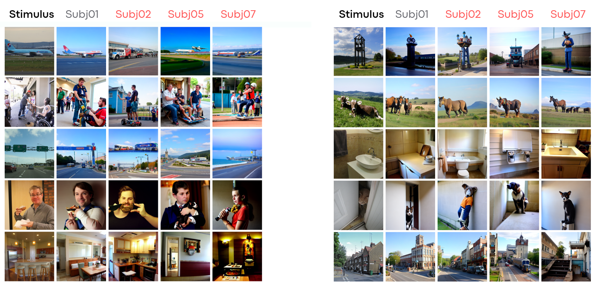

# Cross-subject brain decoding

This repository contains the code to support the "Through their eyes: multi-subject Brain Decoding with simple alignment techniques" paper.

### Abstract
To-date, brain decoding literature has focused on single-subject studies, i.e. reconstructing stimuli presented to a subject under fMRI acquisition from the fMRI activity of the same subject. The objective of this study is to introduce a generalization technique that enables the decoding of a subject's brain based on fMRI activity of another subject, i.e. cross-subject brain decoding. To this end, we also explore cross-subject data alignment techniques. Data alignment is the attempt to register different subjects in a common anatomical or functional space for further and more general analysis.

We utilized the Natural Scenes Dataset, a comprehensive 7T fMRI experiment focused on vision of natural images. The dataset contains fMRI data from multiple subjects exposed to 9841  images, where 982 images have been viewed by all subjects. Our method involved training a decoding model on one subject's data, aligning new data from other subjects to this space, and testing the decoding on the second subject based on information aligned to first subject. We also compared different techniques for fMRI data alignment, specifically ridge regression, hyper alignment, and anatomical alignment.

We found that cross-subject brain decoding is possible, even with a small subset of the dataset, specifically, using the common data, which are around $10\%$ of the total data, namely 982 images, with performances in decoding comparable to the ones achieved by single subject decoding. Cross-subject decoding is still feasible using half or a quarter of this number of images with slightly lower performances. Ridge regression emerged as the best method for functional alignment in fine-grained information decoding, outperforming all other techniques.

By aligning multiple subjects, we achieved high-quality brain decoding and a potential reduction in scan time by $90\%$. This substantial decrease in scan time could open up unprecedented opportunities for more efficient experiment execution and further advancements in the field, which commonly requires prohibitive (20 hours) scan time per subject.

**Data** can freely requested and downloaded at 
https://naturalscenesdataset.org/ or using the python code "download_nsddata.py" and "prepare_nsddata_captions.py" elaborated from the "BrainDiffusers" github repository (https://github.com/ozcelikfu/brain-diffuser/tree/671f1403fe2a0515771c29d64fb839153cf12f5e). To reproduce the pipeline reproduce the first step from this repository to download vdvae weights and frmi data. You'll also need the COCO captions, downloadable from https://cocodataset.org/#home, 2017 split.

Below, you can see the comparison between our reconstructions and related work over the same dataset.

Here we also report data for cross-dataset experiments

**References** 
BrainDiffusers code from Ozcelik et al: https://github.com/ozcelikfu/brain-diffuser/tree/671f1403fe2a0515771c29d64fb839153cf12f5e
OpenAI VDVAE: https://github.com/openai/vdvae
NSD Dataset: https://naturalscenesdataset.org/